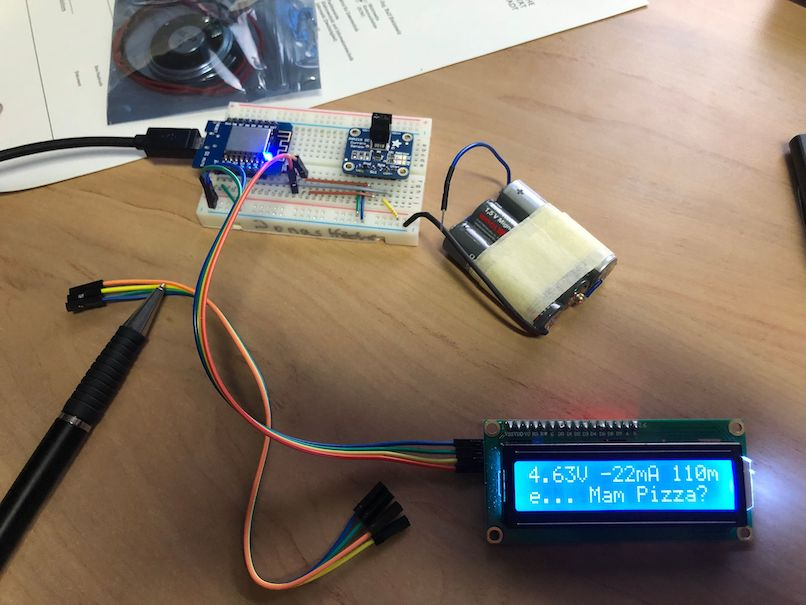

# Doktorhut 
[](https://travis-ci.org/jonashoechst/Doktorhut)

*Der interaktive Doktorhut* ist ein Gimmick für Doktorhüte. Auf dem Hut wird ein **ESP8266** benötigt, der sowohl einen AP öffnet, als auch sich zu einem der konfigurierten WiFis verbindet. 

Die auf dem ESP gespeicherten Zitate werden dann auf einem **OLED oder LCD Display** angezeigt.



## Build

Das Projekt wird mit [platformio](https://platformio.org) gebaut, die Abhängigkeiten sind in der `platformio.ini`-Datei geregelt.

```
$ platformio run
Processing d1_mini_lite (platform: espressif8266; board: d1_mini; framework: arduino)
------------------------------------------------------------------------------------------------------------------------------------------------------------------
Verbose mode can be enabled via `-v, --verbose` option
CONFIGURATION: https://docs.platformio.org/page/boards/espressif8266/d1_mini.html
PLATFORM: Espressif 8266 > WeMos D1 R2 & mini
HARDWARE: ESP8266 80MHz 80KB RAM (4MB Flash)
Library Dependency Finder -> http://bit.ly/configure-pio-ldf
LDF MODES: FINDER(chain) COMPATIBILITY(soft)
Collected 36 compatible libraries
Scanning dependencies...
Dependency Graph
|-- <LiquidCrystal_I2C>
|   |-- <Wire> 1.0
|-- <ESP Async WebServer> 1.2.0
|   |-- <ESPAsyncTCP> 1.2.0
|   |   |-- <ESP8266WiFi> 1.0
|   |-- <ESP8266WiFi> 1.0
|   |-- <Hash> 1.0
|-- <ESP_EEPROM> 2.0.0
|-- <DNSServer> 1.1.0
|   |-- <ESP8266WiFi> 1.0
|-- <Adafruit INA219> 1.0.4
|   |-- <Wire> 1.0
|-- <ESP8266WiFi> 1.0
|-- <ESPAsyncTCP> 1.2.0
|   |-- <ESP8266WiFi> 1.0
Retrieving maximum program size .pioenvs/d1_mini_lite/firmware.elf
Checking size .pioenvs/d1_mini_lite/firmware.elf
Memory Usage -> http://bit.ly/pio-memory-usage
DATA:    [====      ]  42.1% (used 34520 bytes from 81920 bytes)
PROGRAM: [===       ]  30.9% (used 323096 bytes from 1044464 bytes)
================================================================== [SUCCESS] Took 1.87 seconds ==================================================================
```